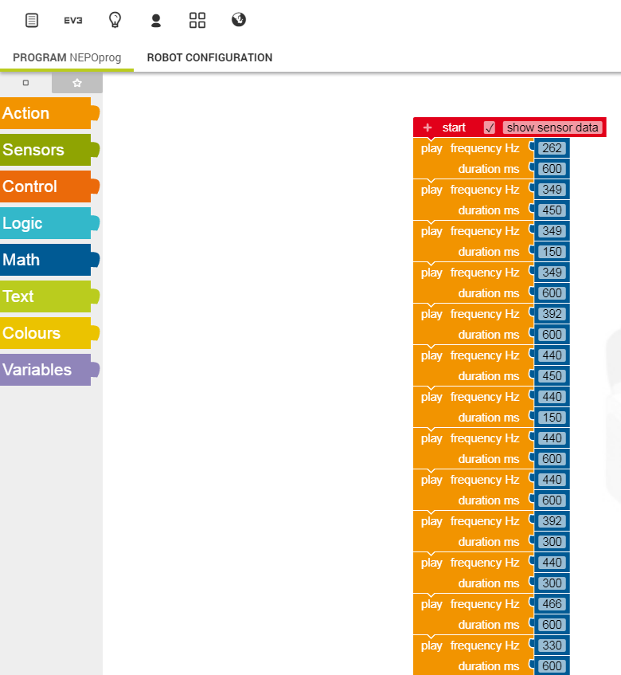

# Convert music from MIDI files to Roberta Lab (NEPO) format (XML)

# Screenshot of the final result



# What is MIDI

Music in computers can be stored as "wave" - recorded by the microphone. The sound is stored as volume of the sound
about 44K times per second. WAV, MP3, OGG files are examples of such format.

[more about WAV](https://en.wikipedia.org/wiki/WAV)

Alternatively music can be stored as "notes" - as musical sheets. Then it is stored as several parallel tracks
of different instruments. Each track is a series of notes having their frequency, volume and duration.

[more about MIDI](https://en.wikipedia.org/wiki/MIDI)

# What is Roberta Lab (NEPO)

Open Roberta Lab is a programming language for programming different robots and prototype boards. Primary focus
is on the easy visual programming language simple enough so it can be used to teach programming at schools.
It's similar to Scratch, but is much newer and more advanced.

[more about NEPO](https://www.open-roberta.org/lab/)

Programs in NEPO can be exported and imported in XML format.

# What does this converter do?

* You can give it a URL of the midi file and it will download it.
* It will convert the binary MIDI file to JSON format which can be read by Python easily.
(This step is not implemented yet, but a manual converter can be used at https://tonejs.github.io/MidiConvert/)
* It will read the JSON format of the midi file and export the notes of the selected track (MIDI files have multiple
tracks for different instruments playing together) into the XML format suitable for importing into NEPO.

# Usage

```
python.exe index.py
<Response [200]>
ParseResult(scheme='http', netloc='www.jump-gate.com', path='/christmas/music/midi/xmastree.mid', params='', query='', fragment='')
midi/xmastree.mid
file midi/xmastree.mid
json json/xmastree.json
tracks 5
track 0 0
track 1 122
track 2 26
track 3 44
track 4 76
blocks 102
```

# Troubleshooting

Install missing requirements with ```pip install jinja2``` for example.
Further questions can be asked in [Issues](https://github.com/spidgorny/midi2nepo/issues)
